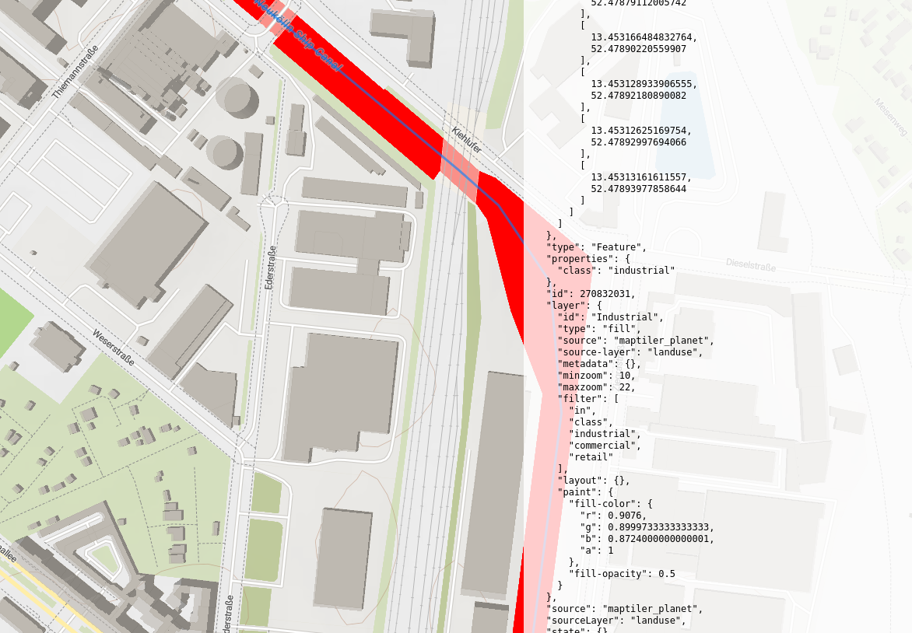

<!--more-->


I recently made a website that reveals rivers and streams encountered on recent cycling or hiking adventures.

{}
[https://kreuzungen.world](https://kreuzungen.world)
{}

The site is powered by OpenStreetMap data and open source technologies.

All source code is available in this [github repository](https://github.com/01100100/kreuzungen)



## Introduction

Last year I embarked on a bike ride from a [geo-spatial-data-conference](spatial-data-science-conference.com) in London to my home in Berlin.

I used [Komoot](https://www.komoot.com) to plan, navigate and record my journey. I set my start point to the Royal Albert hall in London and my end point to Brandenburg Tor in Berlin, with intermediate points being the international ferry ports of Harwich and Hook of Holland. I choose "Road cycling" as my preferred style of riding and hit the "Let's go" button. It was that easy! I am a huge fan of the [Komoot](https://www.komoot.com) app and highly recommend it.


During my multi-day ride, crossing various rivers, a thought struck me:

{}
***How many waterways have I crossed and what are they called?***
{}

Realizing that I had recorded data of the ride, had the great asset of open street maps at my fingertips, and the geo-spatial-data know how, I put a plan together...



{}
**To develop a tool that could be fed with a .gpx recording. It should list all the waterways crossed en route and display a map with the journey and highlight all crossed waterways.**

{}


As a geospatial data engineer, and a lover of long cycles in really remote places, this challenge doesn't sound too hard.

Little did I know that this project would turn out to be much more interesting than first expected, just like the bike journey. I just started and didn't know where it would take me but simply started out in a single direction, and looking back I am quite chuffed with how far I have come and what I have achieved.


The word "Kreuzungen" is German for "crossings" or "intersections"...

{}
[https://de.wiktionary.org/wiki/Kreuzung](https://de.wiktionary.org/wiki/Kreuzung)
{}


## Geospatial Data 101

Geospatial data, in its simplest form, refers to information that describes an object in space.

It consists of two parts: the "where" and the "what". The "where" part includes spatial information describing the geometry and location of an object, while the "what" part includes non-geometric properties/attributes that describe and give meaning to an object.

### Geometry

The spatial part is composed of different types of geometries. The primitive types of geometry are points, lines and polygons. These are the building blocks of geospatial data, and out of them we can build some amazing things.

- A Point: represents a specific location on the Earth's surface, defined by its latitude and longitude coordinates. It is often used to mark a point of interest, such as a atm, traffic light or water fountain.
- A LineSting: represents a path made up of a ordered series of connected points. A hiking path, road or a river.
- A Polygon: A polygon is a closed shape with the vertices defined by a ordered series of points. It is used to represent areas like countries, cities, or lakes. Polygons are defined by a list of coordinates that outline their boundaries.

```goat
                             *-----*
    *    *---*-*            /       \ 
                \          /         \
                 *---*    *-----------*
```

**Any geometry combined with non-geometric properties is a geometric feature.**

Sometimes, a single geometry type might not be sufficient to represent a feature. For example, a river system with multiple branches cannot be accurately represented by a single LineString. In such cases, we can use multi geometry features like a MultiLineString or a MultiPolygon.

We can group different features together to form a feature collection. Imagine you want to represent all the rivers, lakes and wells in a region. You could group them together in a feature collection using

### An Example: Dicke Marie (Fat Mary)

If you go into Tegel Forest in the east of Berlin, you might bump into the so called "Fat Mary". This is the name given to a really old, award winning Oak tree, estimated to be over 800 years old.

[https://berlindoodleblog.blogspot.com/2015/02/dicke-marie.html](https://berlindoodleblog.blogspot.com/2015/02/dicke-marie.html)


Let's imagine what the geospatial data would look like that describes this great tree...

First we should define the location or the "where" of Dicke Marie. We could use words to do this, perhaps "North East of Berlin", "In Tegel" or "about 300m south of Tegel Schloss" However we can do much better if we define with the position with a single set of co-ordinates `(52.5935770, 13.2649068)` locating the point where the centre of the tree trunk comes out of the ground. These numbers are much more powerful then the wordy descriptions. It fixes it to a set position on a grid of the world, and the numeric values can be quickly and efficiently compared to other geospatial data types to answer questions like.. "How far is this point east of point x" "Does this point lie within polygon z?". Ohhh, I feel the power of this geospatial stuff.

Now we can add some "what" properties describe Fat Marie. Perhaps we can add the following properties:

| Property | Value |
|----------|-------|
| type     | tree  |
| name     | Dicke Marie |
| species  | Quercus robur |
| height   | 23    |
| wikipedia | [https://de.wikipedia.org/wiki/de:Dicke_Marie](https://de.wikipedia.org/wiki/de:Dicke_Marie) |

Using the geojson data format, a Dicke Marie could be written like this

```json
{
    "type": "Feature",
    "properties": {
        "name": "Dicke Marie",
        "natural": "tree",
        "species": "Quercus robur",
        "height": "23",
        "wikipedia": "de:Dicke Marie"
    },
    "geometry": {
        "type": "Point",
        "coordinates": [
            13.2649068,
            52.593577
        ]
    }
}
```

In fact someone already defined Dicke Marie using geospatial data and added it to Open Street Maps

[https://www.openstreetmap.org/node/205066401](https://www.openstreetmap.org/node/205066401)

<!-- TODO: add a map with a symbol for Dicke Marie and properties when you click it -->
<!-- <iframe width="425" height="350" src="https://www.openstreetmap.org/export/embed.html?bbox=13.261943757534029%2C52.59276736525819%2C13.267200887203218%2C52.59438693697444&amp;layer=mapnik" style="border: 1px solid black"></iframe><br/><small><a href="https://www.openstreetmap.org/#map=19/52.59358/13.26457">View Larger Map</a></small> -->

## What is a river?

The big question. A river is a natural flowing watercourse that typically moves towards an ocean, sea, lake, or another river. It plays a vital role in the Earth's hydrological cycle and supports various ecosystems and human activities. There is a hour long podcast that dives into this in more depth.

<iframe style="border-radius:12px" src="https://open.spotify.com/embed/episode/2Azu2f93hikPGcwQJ876QK?utm_source=generator&theme=0" width="100%" height="152" frameBorder="0" allowfullscreen="" allow="autoplay; clipboard-write; encrypted-media; fullscreen; picture-in-picture" loading="lazy"></iframe>

This a very interesting question to think about, but philosophizing about what constitutes a river doesn't help me solve the problem of working out which rivers I crossed on my bike ride. A better question would be "Where can I get data from and how can I define waterways in geospatial data terms?"

## OpenStreetMap


TODO: link to OSM iceberg meme

[OpenStreetMap](https://www.openstreetmap.org/) (OSM) is an incredible resource, akin to the Wikipedia of maps. It's a collaborative project where a community of mappers from around the world contribute to creating a free and editable map of the world. This was not possible 25 years ago, and the existence of such a resource today is a testament to the power of community and open source efforts.

The data is freely available under an open license, and it's maintained and updated by volunteers. This means that the data is constantly being updated, reflecting changes in the real world.

Everyone can make use of this data and create applications scaling to cover the whole world. OSM already powers many of the maps you see on the web today.



[StreetComplete](https://streetcomplete.app) is an Android app that allows users to easily edit and improve OpenStreetMap data without any specific knowledge of OSM tagging schemes. It asks simple questions and uses the answers to directly edit the map. It's designed for users who want to contribute to OpenStreetMap but don't have expertise in OSM.



One of the key features of OSM is the ability to tag different elements with various attributes. For this project, the 'waterway' key is particularly useful [https://wiki.openstreetmap.org/wiki/Key:waterway](https://wiki.openstreetmap.org/wiki/Key:waterway)
. This key is used to describe natural or artificial water flows like rivers, streams or canals, as well as elements which control the water flow such as dams and weirs. Sounds exactly what I am looking for to work out which rivers I crossed.

Here are examples of different waterways in OSM:

| Waterway Type | Description | Example |
|---------------|-------------|---------|
| River         | A large natural waterway | The River Thames |
| Stream        | A small natural waterway | A stream in your local park |
| Canal         | A man-made waterway used for transportation, irrigation, or drainage | The Suez Canal |


### OpenStreetMaps data model

OpenStreetMap's data model is quite simple and consists of three main elements

- **Nodes**: These are individual points on the map. Each node has a latitude and longitude. For example, a node could represent a park bench or a water fountain. A node corresponds to a **POINT**.

- **Ways**: These are ordered lists of nodes, representing a polyline on the map. Ways are used for longer features that cover more distance, like roads or rivers. A way corresponds to a **LineString**.

- **Relations**: These are groups of nodes, ways, and other relations that define a larger entity. For example, a relation could represent a cycle route that consists of many different ways. A relation corresponds to a MultiLineString or a Polygon, depending on the nature of the relation.

#### Tagging

Each of these elements can have tags, which are key-value pairs used to store metadata about the element. For example, a way representing a road could have a tag `highway=residential` indicating it's a residential road.

For more information, visit the [OpenStreetMap Elements page](https://wiki.openstreetmap.org/wiki/Elements).

#### Waterways

When we query OSM for waterways, we get back a line or multiline string representing the waterway in OSM format.

There is a difference between the waterway [**way**](https://wiki.openstreetmap.org/wiki/Way) in OSM and the greater [waterway **relation**](https://wiki.openstreetmap.org/wiki/Relation:waterway).  A waterway **way** is a single segment of a waterway. A waterway **relation** is a group of the smaller ways to form a larger entity, like a big river can be made from many smaller streams.

Most "main" rivers in Europe are tagged as relations, while almost all smaller rivers and streams are represented as ways.

You can visit [this link](https://wiki.openstreetmap.org/wiki/Waterways). It provides detailed explanations about the tags used for waterways and the properties associated.

### Overpass API

The OSM database is huge. [Planet.osm](https://wiki.openstreetmap.org/wiki/Planet.osm) is a single file containing all OpenStreetMap data (currently over 1902.6 gb uncompressed and growing), and it's not practical to download and process the entire dataset every time you want to work with a few features.

OpenStreetMap offer a read-only public API with [http://overpass-api.de](http://overpass-api.de). It has a usage policy: You can safely assume that you don't disturb other users when you do less than 10,000 queries per day and download less than 1 GB data per day[1].

This API makes it easy to request data and work with it programmatically, and by providing a query language called Overpass QL, which is similar to SQL, which allows you to get exactly what you need from a truly vast amount of geospatial data. This is perfect for this project.



[Overpass Turbo](https://overpass-turbo.eu/) is a web-based data filtering tool for OpenStreetMap. It's a great tool for testing out queries because it provides a visual interface for constructing and running Overpass API queries. It also displays the results on a map, making it easy to verify the queries.


// TODO: link to the query that produced this.



TODO: talk about how a big part of the problem is filtering the data to as little as possible before running the computations, and you should do as much of this upstream as possible with the overpass api.

## Ok enough theory, lets solve the problem.

Breaking it down there are a few parts to the tool I want to make:

1. Uploading a route.
1. Fetching river data from OSM
1. Calculating the intersections
1. Visualizing the results

A little website could work well for this. The browser can take care of the the route uploading with the [FILE API](https://developer.mozilla.org/en-US/docs/Web/API/File_API), requesting OSM data can depend on the [FETCH API](https://developer.mozilla.org/en-US/docs/Web/API/Fetch_API), and visualizing it with the help of [MapLibre GL JS](https://maplibre.org/maplibre-gl-js/docs). Processing the route and computing intersection can be done natively in language of the browser, javascript, with high grade geospatial functionality being imported from [turf.js](https://turfjs.org/). By depending on the browser, I should be able to avoid the need of hosting any backend and reduce the complexity of the project.

### Design

The website should be simple and easy to use. Easier said then implemented!

When the user navigates to [https://kreuzungen.world](https://kreuzungen.world) I want them to see a map. There should be a container with text explaining the site, and a button to upload a route from there device. When the user uploads a .gpx file, it should be displayed on the map. Then the site should fetch the waterway data in the background and compute the intersecting waterways before highlighting them on the map and listing the river names. The user should be able to explore the map and river data using intuitive interactions, there should be information shown for every river with its properties and a link to the data source.

### The build

### The body of the machine

The html should be quite simple. Let's start basic with a input for the file handling and a div for the map. The map should take up the whole screen. Inside the map should be a couple be containers for the displaying of text information. A "info-container" will explain how to use the site, and another which is initially set to not be displayed, but will later show information from the uploaded route.

```html
<!DOCTYPE html>
<html lang="en">
<head>
  <script src="https://unpkg.com/maplibre-gl@latest/dist/maplibre-gl.js"></script>
  <link href='https://unpkg.com/maplibre-gl@latest/dist/maplibre-gl.css' rel='stylesheet' />
  <style>
    html {
      height: 100%;
    }

    body {
      height: 100%;
    }

    #map {
      min-height: 100%;
      max-height: 100%
    }
  </style>
</head>
<body>
  <!-- File input and map container -->
  <input type="file" id="fileInput" accept=".gpx" />
  <div id="map">
    <div id="info" class="info-container">
      <div class="help-message">
        <h2 style="text-align: center">Welcome! 🌍🚴‍♂️</h2>
      </div>
    </div>
    <div id="source" class="source-container" style="display: none;"></div>
  </div>

</body>
<script>
  // create map

  // create event handler to load gpx file on the map
</script>
```


I will use MapLibre GL JS to render the map. It's a great library that allows you to create interactive maps with vector tiles. It's based on WebGL, which means it can render maps quickly and efficiently in the browser.

MapLibre  will inject a map into the div with the id "map". The map will be centered on the [natural center of the world in Greenwich](https://en.wikipedia.org/wiki/Prime_meridian_(Greenwich)#history), and have a zoom level of 10. The map will have a "outdoor-sy" style from [MapTiler](https://www.maptiler.com/), a company that provides vector tiles for maps.

### Error! DataFormat Unknown

If you ran the above code, you would have unfortunately noticed a nice error message. In life, things don't always work out first try... That's ok, we can look into the error, and we can fix it. Here you'll see that MapLibre is expected at Geojson and not the gpx file that the user uploaded. We are very fortunate that there is a great library out there that will convert between these from MapBox. So let's Plug that in and get things up and running.


```typescript
export async function parseGPXToGeoJSON(GPXContents: string) {
  const doc = new DOMParser().parseFromString(GPXContents, "text/xml");
  return toGeoJSON.gpx(doc);
}
```


### Uploading a route

I added a hidden [file input](https://developer.mozilla.org/en-US/docs/Web/HTML/Element/input/file) to the html to facilitate the file upload. The user can then click on a button to trigger the file input, or 

The user can then select a file, and the file input will emit a change event. I added an event listener to the file input, such that the change event will call code that reads the .gpx file, displays it on the map and then processes it.

```html
<!-- File input and map container -->
<input type="file" id="fileInput" style="display: none;" />
<div id="map">
  <div id="faq" class="faq-container" style="display: none;">
    <%= require('./faq.md') %>
  </div>
  <div id="info" class="info-container">
    ...
  </div>
</div>
```

#### Why convert?

By converting the OSM and route geographic data to geojson, I could use turf.js to do all spatial analytics in the js code, meaning the computing would be done client side and no backend would be required! 

TODO:

### Fetching river data from OSM

I can use the Overpass API to fetch all the waterways within a bounding box. The query I used looks like this

```
[out:json];(rel["waterway"]({{bbox}});way["waterway"]({{bbox}});)->._;out geom;
```

This has three parts to it, and aims to capture all potentially intersecting waterways, while keeping the data as small as possible.

* `[out:json]` - specifies that the output should be in JSON format.
* `(rel["waterway"]({{bbox}});way["waterway"]({{bbox}});)->._` selects all the relations and ways tagged as "waterway" within the bounding box and combines the result. The `{{bbox}}` part is a placeholder that gets replaced with the actual bounding box coordinates.
* `out geom;` means that [the geometry of the selected elements](https://wiki.openstreetmap.org/wiki/OSM_XML#Overpass_API_out_geom) is returned.

TODO: explain how when we have a bigger region, we might want to only look at relations and not ways.

TODO: talk about when it would make sense to download the OSM planet dataset and then store and serve the waterways data on my own server, and when it would make sense to fetch it from the overpass api.

Going back to my point about not needed a backend, this is only possible due to the existence of the overpass api.

However on my webhook backend server, I am likely going to request the same river data many times for well traveled regions. Eacch subsequent request is redundant (Ignoring the temporal changes. If someone has built a new canal in Berlin and added it to OSM, since the last request of Berlin waterways, then it is worth knowing about). The idea of caching requests is a good one, however its not practical due to the requests being specific to a routes bounding box, and the fact they are unlikely to not be unique. It would be more efficient to download the OSM data once and store it on my server, accessing it willi nilli. Although this adds a burden on me, to maintain a server and keep the data up to date, it would be more efficient and faster for the user, and most importantly would limit the number of redundant requests to the overpass api. However, I don't imagine my little project will be getting that much traffic, so I will stick with the overpass api for now and deal with this if/when I get hit with some major traffic.

consider when we are getting the citys a route crosses through, there are two ways to make a scaleable solution for the whole world:

1. Download the OSM planet dataset and store it on a server, then query the server for the data.
2. Use the overpass api to fetch the data on the fly.

The first option is more efficient, but requires a lot of storage and maintenance. The second option is less efficient, but is easier to set up and maintain.

The reality is that I am a very little app with a few users, and the users are located in very few places. I can get away with using the overpass api for now, and if I get more users, I can always switch to the first option and save some load on the overpass api .

#### Combining the LineStrings and MultilineStrings into a feature collection of single rivers

The Overpass API returns a list of features, each representing a waterway. The features can be of type `LineString` or `MultiLineString`, depending on the complexity of the waterway.

There are also thousands of disjoint ways that make up a single river. To make the data easier to work with (due to the performance fact that we only look for the single intersection point and skip the rest), I combined all the features with a matching name into a single feature.

This makes it easier to iterate over the individual rivers and calculate intersections with the uploaded route.

The one downside is the problem of common name rivers... TODO: talk about this.

### Intersections

TODO: introduce turf.js

TODO: talk about converting everything to geojson

TODO: talk about combining the features in the feature collection together to handel both ways and relations

TODO: talk about the self-intersections problem and the hidden option of passing the `{ ignoreSelfIntersections: true }` parameter to the `lineIntersect` function.

TODO: talk about the tests used to verify this was fixxed ^^ 

```js

#### Let's talk about time complexity

Finding out which rivers intersect with the uploaded route is taken care of by turf.js, using the [`booleanIntersects()`](https://github.com/Turfjs/turf/tree/master/packages/turf-boolean-intersects) function.

```js
function filterIntersectingWaterways(waterwaysGeoJSON, routeGeoJSON) {
  return waterwaysGeoJSON.features.filter((feature) =>
    turf.booleanIntersects(feature, routeGeoJSON)
  );
}
```

The `turf.booleanIntersects()` implementation uses the [sweepline-intersections](https://github.com/rowanwins/sweepline-intersections?tab=readme-ov-file#algorithm-steps) algorithm, and although it is optimized to blaze through co-ordinate pairs super fast, it has quadratic [time complexity](https://en.wikipedia.org/wiki/Time_complexity).

$$ \mathcal{O}(n^2) $$



That's a fancy way of saying as the input data gets big (number of waterways to check for intersections), the time is takes to compute gets realllllly big.


The key to solving the problem involves keeping the input data "somewhat" small such that device doing the computation does not melt and crash.

### Visualising the results

#### Maplibre gl

TODO: write about slippy maps, how good maplibre is because of vector tiles, allowing for zooming in and out without pixelation and ability to render features conditionally on the client side.

TODO: include some history of webmaps.


https://en.wikipedia.org/wiki/Web_mapping 

TODO: talk about the tradeoffs between vector and raster maps, and explain why vector maps are the best for this project.

TODO: Link to and explain that even OSM are going to vector based maps this year because they are so much better. [https://blog.openstreetmap.org/2024/02/11/2024-announcing-the-year-of-the-openstreetmap-vector-maps/](https://blog.openstreetmap.org/2024/02/11/2024-announcing-the-year-of-the-openstreetmap-vector-maps/)

### Vector tile provider 

TODO: talk about how it would be possible to generate these using open data and a machine, but it is not needed as there are many shops offering this product, in a way thats been optimally distibuted (CDN)

eg) The complete OSM vector tile data set is >110gb https://data.maptiler.com/downloads/dataset/osm.

https://wiki.openstreetmap.org/wiki/Vector_tiles#Providers

TODO: Talk about maptiler and stadia maps both offering free tiers for serving vector map tiles. Maptiler give 100,000 requests per month for free. 

### Features

TODO: talk about being happy with the look and feel of maplibre, and reusing the css for displaying info.

#### Custom controllers

TODO: talk about the code to make the upload and strava controller.

#### Contain yourself

### Killer feature: Strava integration

TODO: explain that while some people do, most people don't know what a .gpx file is and don'
t have files laying stored on there local device. The typical cyclist/hiker would likely have activities on strava. Explain that you implemented a "connect with strava" button and wrote the code to fetch activities from strava and display them in a menu withing the app. Explain how this lets users circumvent  needing to know what a .gpx file or uploading anything and leads to a streamlined experiance for the user. 

### Strava Oauth

TODO: we want users to connect with strava and then request the activites data from Strava. give a brief explination of what a oauth flow is and  explain why it is impossible to avoid situation of adding a backend to implement strava oauth. Explain that a backend is needed to hold the client secret and avoid it being in the front end and thus leaked into the world. Explain the intention to keep the backend as lightweight as possible using flask and point to the codein `src/auth.py`, and mention much could be improved.

> All developers need to register their application before getting started. A registered application will be assigned a client ID and client secret. The secret is used for authentication and should never be shared.
- https://developers.strava.com/docs/authentication/

Putting the client secret in the frontend would compromise the security of the application.

TODO: talk about using flask and cors, and serving it with waitress because security reasons.

```python
import requests
from flask import Flask, request
from waitress import serve

from config import get_config_values, get_logger

### SET UP ENVIRONMENT ###
logger = get_logger()
CONFIG = get_config_values()

app = Flask(__name__)


@app.after_request
def after_request(response):
    response.headers.add("Access-Control-Allow-Origin", "*")
    response.headers.add("Access-Control-Allow-Headers", "Content-Type,Authorization")
    response.headers.add("Access-Control-Allow-Methods", "GET,PUT,POST,DELETE,OPTIONS")
    return response


@app.route("/oauth", methods=["POST"])
def oauth_callback():
    code = request.form.get("code")
    response = requests.post(
        f"{CONFIG.STRAVA_API_URL}/oauth/token",
        data={
            "client_id": CONFIG.STRAVA_CLIENT_ID,
            "client_secret": CONFIG.STRAVA_API_CLIENT_SECRET,
            "code": code,
            "grant_type": "authorization_code",
        },
    )
    if response.status_code != 200:
        raise Exception(
            f"Error fetching access token, status code {response.status_code}"
        )
    response.json()

    return response.json()


@app.route("/reoauth", methods=["POST"])
def refresh_token():
    refresh_token = request.form.get("refreshToken")
    response = requests.post(
        f"{CONFIG.STRAVA_API_URL}/oauth/token",
        data={
            "client_id": CONFIG.STRAVA_CLIENT_ID,
            "client_secret": CONFIG.STRAVA_API_CLIENT_SECRET,
            "refresh_token": refresh_token,
            "grant_type": "refresh_token",
        },
    )
    if response.status_code != 200:
        raise Exception(
            f"Error refreshing access token, status code {response.status_code}"
        )
    response.json()

    return response.json()


if __name__ == "__main__":
    serve(app, listen="*:8080")
```

TODO: talk about using this dockerfile to build the backend service

```Dockerfile
FROM python:3.11-slim-buster

COPY requirements.txt requirements.txt
RUN pip install -r requirements.txt

COPY src src

ENTRYPOINT ["python", "src/auth.py"]
```

TODO: talk about deploying this on fly.io using the following config

```toml
# See https://fly.io/docs/reference/configuration/ for information about how to use this file.
#

app = 'kreuzungen'
primary_region = 'ams'

[http_service]
  internal_port = 8080
  force_https = true
  auto_stop_machines = true
  auto_start_machines = true
  min_machines_running = 0
  processes = ['app']

[[vm]]
  cpu_kind = 'shared'
  cpus = 1
  memory_mb = 256
```

TODO: talk about how you set the secrets on fly.io using the commands

``` bash
fly secrets set STRAVA_API_CLIENT_SECRET=$STRAVA_API_CLIENT_SECRET
fly secrets set STRAVA_REDIRECT_URI=$STRAVA_REDIRECT_URI
fly deploy
```

### Answering the community**: Make it easy to share the good stuff

A *early-beta-tester* (you know who you are) gave me some feedback that they would like to share the site with friends. This  which gave me a few ideas:

- Have the website preview displayed nicely when shared in a messaging app or on social media by using the [Open Graph protocol](https://ogp.me/)
- Have a share-with-social-media* button.
- Create a url link to a actual activity from a user which they could send to a mate to explore.
  - Encode the a users activity into a string.
  - Add it to a sharable link with a url parameter.
  - Parse the route and decode it on the new client.

#### What the OPG?

> The Open Graph protocol enables any web page to become a rich object in a social graph**

That sounds pretty good! Basically you can add some specific `<meta>` tags to the `<head>` of a website, and when you share a url in social-media/messaging apps will render the content and display a little preview. You know when you share a link in whatsapp and it shows a little image and a description? That's the Open Graph protocol in action.

This was a easy one to implement after reading the spec on [https://ogp.me](https://ogp.me). I looked up the optimal image dimensions and according to *reasons* this was **1200px x 630px**. The result was added in the following code

```html {linenos=table,hl_lines=["4-10"],linenostart=4}
<head>
  <title>Kreuzungen 🗺️</title>
  <!-- Metadata -->
  <meta property="og:title" content="Kreuzungen 🗺️" />
  <meta property="og:description" content="Upload a GPX file and see which waterways were crossed." />
  <meta property="og:type" content="website" />
  <meta property="og:url" content="https://kreuzungen.world/" />
  <meta property="og:image" content="https://kreuzungen.world/img/screenshot.jpg" />
  <meta charset="utf-8" />
  <meta name="viewport" content="width=device-width, initial-scale=1" />

```

At first the image was not being displayed when I shared it via whatsapp, however a [quick stackoverflowing](https://stackoverflow.com/a/39182227) explained WhatsApp only supports images less than 300kb in size so I added a compressed image.


Everything worked, the internet is magic sometimes!


https://opengraph.dev is a nice site to test out how the content is rendered on different platforms.


### Share button

> Thousands of candles can be lit from a single candle, And the life of the candle will not be shortened. Happiness never decreases by being shared. - The Buddha

I wanted to have a nice and easy way for people to share the map, because happiness is good. to implement this I created another control with the well known [share icon](https://en.wikipedia.org/wiki/Share_icon).



TODO: put in the many different share icons that people are used to... talk about standardizing this [share icon](https://en.wikipedia.org/wiki/Share_icon)



When the control is clicked on, it should expand and show different options for quickly sharing on different platforms using as well as having a copy button that will copy the url to the clipboard.

The clickingaround-test showed that the copy-to-clipboard didn't feel like it was working because there was no user feedback. To fix that I implemented a message to flash on the screen and signify that the copy action has been done, it fades out after 0.5s.

```js
class ShareControl {
      onAdd(map) {
        this._map = map;
        this._container = document.createElement('div');
        this._container.className = 'maplibregl-ctrl maplibregl-ctrl-group';
        this._container.style.margin = '0 10px'

        const urlButton = document.createElement('button');
        urlButton.id = 'urlButton'
        urlButton.type = 'button';
        urlButton.style.display = 'none'
        urlButton.title = 'Copy url to clipboard';
        urlButton.style.borderRadius = "4px";
        urlButton.onclick = () => {
          navigator.clipboard.writeText(shareableUrl)
            .then(() => {
              console.log('URL copied to clipboard: ' + shareableUrl);
              const mapContainer = document.getElementById("map");
              const messageContainer = document.createElement("div");
              messageContainer.className = "url-copied-message";
              const icon = document.createElement("i");
              icon.className = "fa-solid fa-link";
              const text = document.createTextNode("URL copied to clipboard.");
              messageContainer.appendChild(icon);
              messageContainer.appendChild(text);
              mapContainer.appendChild(messageContainer);

              // Fade out the message by setting opacity to 0
              setTimeout(() => {
                messageContainer.style.opacity = 0;
                setTimeout(() => {
                  mapContainer.removeChild(messageContainer);
                }, 500); // Fade out for 500 milliseconds
              }, 500); // Displayed solid for 500 milliseconds
            })
            .catch(err => {
              console.error('Unable to copy URL to clipboard', err);
            });
        };

        const urlIcon = document.createElement('i');
        urlIcon.className = 'fa-solid fa-link';
        urlButton.appendChild(urlIcon);

        const emailButton = this.createShareButton('email', 'fa-solid fa-envelope');
        emailButton.addEventListener('click', () => {
          window.open(`mailto:?subject=Check out what has been crossed on my latest adventure!&amp;body=Check out this site ${shareableUrl}`, '_blank');
        });
        const whatsappButton = this.createShareButton('whatsapp', 'fa-brands fa-whatsapp');
        whatsappButton.addEventListener('click', () => {
          // https://faq.whatsapp.com/5913398998672934
          if (isRouteDisplayed) {
            var whatsappMessage = `Check out the waters I crossed on a recent adventure.. ${shareableUrl}`
          } else { var whatsappMessage = `Check out this site for you recent adventures.. ${shareableUrl}` }
          let whatsappShareLink = `https://wa.me/?text=${encodeURIComponent(whatsappMessage)}`
          window.open(whatsappShareLink, '_blank');
        });
        const facebookButton = this.createShareButton('facebook', 'fa-brands fa-facebook');
        facebookButton.addEventListener('click', () => {
          window.open(`https://www.facebook.com/sharer/sharer.php?u=${shareableUrlEncoded}`, '_blank');
        });
        const twitterButton = this.createShareButton('twitter', 'fa-brands fa-twitter');
        // https://developer.twitter.com/en/docs/twitter-for-websites/tweet-button/guides/web-intent
        twitterButton.addEventListener('click', () => {
          if (isRouteDisplayed) {
            var twitterMessage = `Check out the waters I crossed on a recent adventure..`
          } else { var twitterMessage = `Check out this site for you recent adventures..` }
          window.open(`https://twitter.com/intent/tweet?url=${shareableUrlEncoded}&text=${twitterMessage}`, '_blank');
        });
        this._container.appendChild(urlButton);
        this._container.appendChild(emailButton);
        this._container.appendChild(whatsappButton);
        this._container.appendChild(facebookButton);
        this._container.appendChild(twitterButton);

        const shareButton = document.createElement('button');
        shareButton.type = 'button';
        shareButton.title = 'Share';
        shareButton.style.borderRadius = "4px";
        shareButton.onclick = () => {
          if (isShareExpanded) { this.minimizeShareControl() } else { this.expandShareControl(); }
        };

        const shareIcon = document.createElement('i');
        shareIcon.className = 'fa-solid fa-share-nodes'; // Assuming you are using FontAwesome for icons
        shareButton.appendChild(shareIcon);

        this._container.appendChild(shareButton);

        return this._container;
      }

      createShareButton(id, faIcon) {
        const button = document.createElement('button');
        button.id = `${id}Button`
        button.type = 'button';
        button.style.display = 'none'
        button.title = id;
        button.style.borderRadius = "4px";
        const icon = document.createElement('i');
        icon.className = faIcon;
        button.appendChild(icon);
        return button;
      }

      minimizeShareControl() {
        const urlButton = document.getElementById("urlButton");
        urlButton.style.display = 'none';
        const emailButton = document.getElementById("emailButton");
        emailButton.style.display = 'none';
        const whatsappButton = document.getElementById("whatsappButton");
        whatsappButton.style.display = 'none';
        const twitterButton = document.getElementById("twitterButton");
        twitterButton.style.display = 'none';
        const facebookButton = document.getElementById("facebookButton");
        facebookButton.style.display = 'none';
        isShareExpanded = false
      }

      expandShareControl() {
        const urlButton = document.getElementById("urlButton");
        urlButton.style.display = 'block';
        const emailButton = document.getElementById("emailButton");
        emailButton.style.display = 'block';
        const whatsappButton = document.getElementById("whatsappButton");
        whatsappButton.style.display = 'block';
        const twitterButton = document.getElementById("twitterButton");
        twitterButton.style.display = 'block';
        const facebookButton = document.getElementById("facebookButton");
        facebookButton.style.display = 'block';
        isShareExpanded = true
      }

      onRemove() {
        this._container.parentNode.removeChild(this._container);
        this._map = undefined;
      }
    }
```

Going deeper

### ✨ Route shared with magic link ✨

I want to avoid adding a backend and having to deal with user data storage. So this must be done on the client side. The site so far is stateless, so the problem is simply how to share the route data from one user to another.

One way is to enocde it and add it to the url parameters. The polyline format is a perfect choice for this for this, it enocodes a line, or more specifically a series of coordinates into a single string

Let have a look at how the walk from Brandenburg Tor to the Reichstag would be encoded.
```json
{
  "type": "LineString",
  "coordinates": [
    [
      13.37749,
      52.51626
    ],
    [
      13.3772,
      52.51624
    ],
    [
      13.37703,
      52.5164
    ],
    [
      13.37651,
      52.51638
    ],
    [
      13.37674,
      52.51664
    ],
    [
      13.37442,
      52.51769
    ]
  ]
}
```

```text
sap_IixspABx@_@`@BfBs@m@qEnM
```


TODO: add codesandbox to let the reader play around.

That looks much better. This is almost good enough to be used in a url that someone could share through an app. To improve things a little I will avoid them pesky characters `backticks` that mess up the url displaying in whatsapp.

Anytime a route is processed I update the `shareableUrl` variable with a `route` parameter equal to the encoded polyline.

```js
shareableUrl = `https://kreuzungen.world/index.html?route=${encodeURIComponent(polyline.fromGeoJSON(displayedRouteGeoJSON))}`
```
Then 
```js
if (urlParams.has('route')) {
  var route = urlParams.get('route')
  coordinates = polyline.decode(route);
  geojson =  polyline.toGeoJSON(route)
  geojson.properties = { "name":  "✨ Route shared with magic link ✨"};
  // Ensure the map style is loaded before processing the route.
  if (mapInstance.isStyleLoaded()) {
      processGeojson(geojson);
    } else {
      mapInstance.once('style.load', () => {
        processGeojson(geojson);
      });
    }
}
```

### But how long can a url be?


---

#### Diving deeper with the style color

https://maplibre.org/maputnik/

<!-- TODO: write about how to rivers are rendered from the tiles. That the blue river is made up of a way which is a polygon, and a linestring that is the waterway relation or way

https://www.openstreetmap.org/relation/412169#map=19/52.45659/13.39513

https://www.openstreetmap.org/way/307632376#map=16/52.4725/13.4564

  -->

  
  <https://www.openstreetmap.org/way/307632376> is the polygon for the osm water body
  <https://www.openstreetmap.org/way/160175124> is the linestring for the osm waterway way


### Speeding things up.

I want this app to be as fast as possible. Everything feels better when there is a instant reaction, and in the modern "short-attention-span" age, it's kind of a given that things should work quickly and if not people assume something is broken.

#### First things first, lets profile

TODO: link to profiling proj

## Build it and they will come, right?

Ok so the app is built, and it's working. The next step is to share it with the world, and ensure that people can find it when they are looking for it.

### Memorable domain name

I already settled on the name Kreuzungen. It's a German word that means "crossings" or "intersections". It's subjectively short, easy to remember, and it's meaning  is used in the context of the app.

To no surprise, the domain kreuzungen.com was already taken and a short call to the owner assured me that it was not up for sale, ces't la internet.

I looked at what other top level domains were not taken, and although there was not `.en` top level domain so that I could do the cool thing where the fully qualified domain is the world (like `bit.ly`, `redd.it`) I saw that **`krezungen.world`** was available. I liked the way it sounded, so I purchased it. [It should be cool for a long time](https://www.w3.org/Provider/Style/URI).

### DNS

Setting up github pages with my new shiny domain was pretty easy. I followed the [docs](https://docs.github.com/en/pages/configuring-a-custom-domain-for-your-github-pages-site) and configured my DNS with a txt record to verify I owned the domain, and some A records pointing to github servers.

After waiting a few mins, I checked that the records had propagated through the network.

```bash
➜  ~ dig kreuzungen.world +noall +answer -t A
kreuzungen.world.	195	IN	A	185.199.109.153
kreuzungen.world.	195	IN	A	185.199.110.153
kreuzungen.world.	195	IN	A	185.199.108.153
kreuzungen.world.	195	IN	A	185.199.111.153
```

Then I updated the github repo with the custom domain and all seemed good.


A last sanity check with the browser showed that [https://kreuzungen.world](https://kreuzungen.world) was live!


I also made records to point the subdomains `auth.kreuzungen.world` and `stats.kreuzungen.world` to the fly.io servers running the backend and analytics services. This is for cosmetic reasons has no technical advantage (subdomains are still different domains, so CORS still shows up). I avoid the user seeing any requests to `https://random_scary_name.fly.dev/`, and that makes me happy.

### SEO

I am no SEO expert, and everything I implement was based on a few google searches, if any SEO pro's are reading and have some tips, I would love to hear them ([email me](mailto:davidwhittingham94@gmail.com)).

#### Google

It is 2024 and people google things, that is a fact of life and if I want people to be able to find my site, I need to make sure it is displayed on google. Therefore I need to get google to crawl and index it!


Generally, google finds all website and will automatically index them, but this can take time

There are a few things you can do to speed up the process.

00000000000
#### Crawl first before you walk

I added the site to the [google search console](https://search.google.com/search-console/about) and verified that I was the owner of the domain by adding a TXT record to my DNS. 


#### Description

TODO: talk about how you imrpoved the description/snippet [https://developers.google.com/search/docs/appearance/snippet](https://developers.google.com/search/docs/appearance/snippet) with SEO magic.

## Getting hooked into that webhook stuff

I was inspired by what I have seen from [https://wandrer.earth](https://wandrer.earth), [https://summitbag.com](https://summitbag.com) and [https://whatismyskc.com](https://whatismyskc.com) on my friends activities. Theses apps enrich user activities by pushing additional information back to Strava servers, such that the greater Strava community to see it.

I wanted to have a similar feature in my app, a automagical feature that updates the description of an activity with a nice message including the name and number of waterways crossed, and a link to [https://kreuzungen.world](https://kreuzungen.world).




{}
Crossed 5 waterways 🏞️ Nile | Amazon River | Mississippi River | Danube River | Ganges | River Thames 🌐 https://kreuzungen.world 🗺️

_*if any design people are reading this, I would love some help to improve this message_

{}


To accomplish this, I utilized the [Strava Webhook Events API](https://developers.strava.com/docs/webhooks/). I created a subscription and wrote a little server to listen for events from the subscription, process the new activites and update the activity descriptions on Strava in real-time.

This approach eliminates the need for users to manually check activities on [https://kreuzungen.world](https://kreuzungen.world). After a one-time authorization of Kreuzungen with the "Upload your activities from Kreuzungen to Strava" scope set, users should receive automatic and consistent updates about the waterways on their Strava profile, for life.

The enriched activity descriptions are then visible to all on the Strava platform, potentially inspiring others to explore Kreuzungen and join a new community of river lovers.

### Refactor

Krezungen was untill now a webapp written in javascript and running in the browser. I wanted to use the same logic used to process routes in the browser, but I wanted this to run on a lightweight server somewhere that strava could talk to it.

One option I had was to translate the geometry processing code, in my fave language python.

Another way would be to use node to run some of the same code that is used in the frontend. This would be a good way to avoid reimplementing the wheel (or most parts atleast), and keeps a single, nodivergent codebases to work with in the future.

I would need to refactor the code to run it with node. I decided to go with this option, and refactor the code and use TypeScript and use webpack to bundle up the assets needed for the webapp.

The structre would look a little like this:

| File      | Description                                |
|-----------|--------------------------------------------|
| geo.ts    | Contains the geometry processing code       |
| strava.ts | Contains the logic to auth with Strava      |
| main.ts   | Contains the code to be bundled and injected into the webapp |
| app.ts    | Contains the Express server and webhook subscriptions |

### Setting up a webhook subscription

I needed to set up a webhook subscription with Strava to receive events when a user uploads a new activity. I followed the [Strava Webhook Events API](https://developers.strava.com/docs/webhooks/) documentation.

This is a two step part which essentaily involves:

1. setting up a server to listen which will respond correctly to a validation request from Strava
2. making a POST request to the Strava API to create the subscription.

First I created `app.ts` to handle the webhook subscription callback validation flow.

```typescript
// route for '/webhook' to verify the webhook subscription with Strava
app.get("/webhook", (req, res) => {
  const VERIFY_TOKEN = "STRAVA";

  let mode = req.query["hub.mode"];
  let token = req.query["hub.verify_token"];
  let challenge = req.query["hub.challenge"];

  if (mode && token) {
    if (mode === "subscribe" && token === VERIFY_TOKEN) {
      console.log("WEBHOOK_VERIFIED");
      res.json({ "hub.challenge": challenge });
    } else {
      res.sendStatus(403);
    }
  }
});
```

I deploy this to fly.io and register the webhook with Strava with a POST request to the Strava API.

```bash
curl -X POST https://api.strava.com/api/v3/push_subscriptions \
  -H "Authorization
  -H "Content-Type: application/json" \
  -d '{"client_id": 12345, "client_secret": "supersecret", "callback_url": "https://yourdomain.com/webhook", "verify_token": "STRAVA"}'
```

## Squishing bugs

During refactoring I found a bug in the code that was causing the random rivers to creep into the results. After some digging and test writing, it looked like extra waterways were being selected as intersecting with the route when they had a self intersection.

I looked into the turf [booleanIntersects](https://www.npmjs.com/package/@turf/boolean-intersects) implementation, and it turns out that one of the underlying functions lineIntercept() has a `ignoreSelfIntersections` vaiable that can be set. I fixed this locally and the tests passed.

```bash
kreuzungen-py3.11➜  site git:(new) ✗ npm test

> test
> jest --verbose

 PASS  src/geo.test.ts (5.71 s)
  intersectingFeatures
    ✓ should return a FeatureCollection of 2 intersecting kanals  in nk (3 ms)
    ✓ should return a FeatureCollection of 1 intersecting features including Grünerbach and excluding Mandlerbach (15 ms)
    ✓ should return a empty FeatureCollection of intersecting features excluding Mandlerbach (4 ms)
    ✓ should return a FeatureCollection with a single feature Grünerbach (6 ms)

Test Suites: 1 passed, 1 total
Tests:       4 passed, 4 total
Snapshots:   0 total
Time:        5.844 s
Ran all test suites.
```

I want to reuse the geometry processing code that I wrote for the frontend to process the strava activities. I could have copied the code, but that would have been a bad idea, because if I ever wanted to change the way the geometry is processed, I would have to change it in two places. I decided to refactor the code into a separate module that could be imported into the backend.

#### webpack

TODO: explain a bundler and why it is good to use one here

```js
const HtmlWebpackPlugin = require('html-webpack-plugin');
const path = require('path');


module.exports = {
  mode: 'development',
  devtool: 'inline-source-map',
  devServer: {
    static: './dist',
  },
  optimization: {
    runtimeChunk: 'single',
  },
  entry: { main: './src/main.ts' },
  module: {
    rules: [
      {
        test: /\.ts?$/,
        use: 'ts-loader',
        exclude: [/node_modules/, /\.test\.ts$/],
      },
      {
        test: /\.(png|jpe?g|gif|svg)$/i,
        type: 'asset/resource'
      },
      {
        test: /\.css$/i,
        use: ['style-loader', 'css-loader'],
        exclude: /input\.css$/,
      },
      {
        test: /\.md$/,
        use: [
          {
            loader: 'html-loader',
            options: {
              esModule: false,
            },
          },
          {
            loader: 'markdown-loader',
          },
        ],
      },
    ],
  },
  resolve: {
    extensions: ['.tsx', '.ts', '.js'],
  },
  node: { global: true },
  plugins: [
    new HtmlWebpackPlugin({
      template: './src/index.html',
      inject: true,
    }),
  ],
  output: {
    filename: '[name].bundle.js',
    path: path.resolve(__dirname, 'dist'),
  },
};
```

tsconfig.json

```json
{
  "compilerOptions": {
    "target": "es2016",
    "module": "commonjs",
    "outDir": "./dist",
    "esModuleInterop": true,
    "forceConsistentCasingInFileNames": true,
    "strict": false,
  }
  ,    "files": [
    "./src/app.ts",
]
}

package.json

```json
{
  "devDependencies": {
    "@types/jest": "^29.5.12",
    "@types/lodash": "^4.17.0",
    "@types/mapbox__polyline": "^1.0.5",
    "@types/marked": "^6.0.0",
    "@types/umami": "^0.1.5",
    "css-loader": "^7.1.1",
    "html-loader": "^5.0.0",
    "html-webpack-plugin": "^5.6.0",
    "jest": "^29.7.0",
    "markdown-loader": "^8.0.0",
    "marked": "^12.0.2",
    "style-loader": "^4.0.0",
    "tailwindcss": "^3.4.3",
    "ts-jest": "^29.1.2",
    "ts-loader": "^9.5.1",
    "typescript": "^5.4.5",
    "webpack": "^5.91.0",
    "webpack-cli": "^5.1.4",
    "webpack-dev-server": "^5.0.4"
  },
  "scripts": {
    "test": "jest --verbose",
    "build": "webpack",
    "serve": "webpack serve --open",
    "compile": "npx tsc",
    "start": "node dist/app.js"
  },
  "dependencies": {
    "@fortawesome/fontawesome-svg-core": "^6.5.2",
    "@fortawesome/free-brands-svg-icons": "^6.5.2",
    "@fortawesome/free-solid-svg-icons": "^6.5.2",
    "@mapbox/polyline": "^1.2.1",
    "@mapbox/togeojson": "^0.16.2",
    "@turf/boolean-point-in-polygon": "^7.0.0-alpha.115",
    "@turf/helpers": "^7.0.0-alpha.115",
    "@turf/line-intersect": "^7.0.0-alpha.115",
    "@turf/meta": "^7.0.0-alpha.115",
    "@turf/polygon-to-line": "^7.0.0-alpha.115",
    "@turf/turf": "^7.0.0-alpha.114",
    "@umami/node": "^0.2.0",
    "body-parser": "^1.20.2",
    "cross-fetch": "^4.0.0",
    "express": "^4.19.2",
    "font-awesome": "^4.7.0",
    "fontawesome-free": "^1.0.4",
    "geojson": "^0.5.0",
    "lodash": "^4.17.21",
    "maplibre-gl": "^4.1.2",
    "osmtogeojson": "^3.0.0-beta.5",
    "redis": "^4.6.13"
  }
}
```

### Sprinkle Redis in the Mix

I also needed to bite the bullet and admit it was time to set up a perisitant storage.

Up until now, I avoided the need of any storage. However if I want to process strava activities on behalf of users, I would need to re-authenticate with strava without the user .

I added a fly.io redis instance to the backend to store the strava access tokens and refresh tokens. This makes me a full stack developer now, right?

I set env vars for the redis url and password on fly.io and added the following code to the backend to store the tokens.

### Express server and webhook subscriptions

I wanted to have a lightweight backend, and I decided to use express.js to serve the frontend and handle the strava webhooks.

I created a file `src/app.ts` and added the following code to anwser the strava webhook verification and process the incoming events.


```typescript
import express from "express";
import bodyParser from "body-parser";
import { createClient } from "redis";
import {
  getStravaAccessTokenRedis,
  getStravaActivity,
  updateStravaActivityDescription,
} from "./strava";
import { calculateIntersectingWaterwaysPolyline, createWaterwaysMessage } from "./geo";

const app = express().use(bodyParser.json());
const redisClient = createClient({ url: process.env.REDIS_URL });
redisClient.on("error", (error) => {
  console.error(`Redis client error:`, error);
});
main();

// The main asynchronous function
async function main() {
  try {
    await redisClient.connect();
    app.listen(process.env.PORT || 80, () =>
      console.log("webhook is listening")
    );
  } catch (error) {
    console.error("Error connecting to Redis:", error);
  }
}

// route for '/webhook' to verify the webhook subscription with Strava
app.get("/webhook", (req, res) => {
  const VERIFY_TOKEN = "STRAVA";

  let mode = req.query["hub.mode"];
  let token = req.query["hub.verify_token"];
  let challenge = req.query["hub.challenge"];

  if (mode && token) {
    if (mode === "subscribe" && token === VERIFY_TOKEN) {
      console.log("WEBHOOK_VERIFIED");
      res.json({ "hub.challenge": challenge });
    } else {
      res.sendStatus(403);
    }
  }
});

// route for '/webhook' to receive and process incoming events
// must acknowledge each new event with a status code of 200 OK within two seconds.
// Event pushes are retried (up to a total of three attempts) if a 200 is not returned. 
// If your application needs to do more processing of the received information, it should do so asynchronously.
app.post("/webhook", async (req, res) => {
  // return a aknoledgment and process the event asynchronously
  res.status(200).send("EVENT_RECEIVED");
  const event = req.body;
  if (event.aspect_type === "create" && event.object_type === "activity") {
    processAndUpdateStrava(event.owner_id, event.object_id);
  }
  else if (event.aspect_type === "update" && event.object_type === "athlete" && event.updates && event.updates.authorized === "false") {
    deleteUser(event.owner_id)
  }
});

async function processAndUpdateStrava(owner_id, activity_id,) {
  try {
    const owner_access_token = await getStravaAccessTokenRedis(
      owner_id,
      redisClient
    );
    if (!owner_access_token) {
      console.error("No access token found for user_id: " + owner_id);
      return;
    }
    const activityData = await getStravaActivity(
      activity_id,
      owner_access_token
    );

    if (!activityData.map || !activityData.map.summary_polyline) {
      console.error(
        "Activity does not have a summary polyline:",
        activityData
      );
      return;
    }

    const intersectingWaterways = await calculateIntersectingWaterwaysPolyline(
      activityData.map.summary_polyline
    );

    if (intersectingWaterways.features.length === 0) {
      console.log("No intersecting waterways found");
      return;
    }
    
    const waterwaysMessage = createWaterwaysMessage(intersectingWaterways);

    // update the activity description with the waterways message if there are waterways
    const success = await updateStravaActivityDescription(
      activity_id,
      owner_access_token,
      waterwaysMessage
    );
    if (success) {
      console.log(`Updated activity https://www.strava.com/activities/${activity_id} with ${waterwaysMessage}`)
    } else {
      console.error(`Failed to update activity description for activity_id: ${activity_id}`);
    }
  } catch (error) {
    console.error("Error updating activity description", error);
  }
}

async function deleteUser(owner_id) {
  try {
    await redisClient.del(owner_id.toString());
    console.log(`Deleted access token for user_id: ${owner_id}`);
  } catch (error) {
    console.error("Error deleting access token", error);
  }
}
```


```python

```
TODO: copy code
```

```bash
TODO: copy code
```

### Strava API webhooks

TODO: add video

TODO: add section on manual update button.

## Adding a faq section

I wrote up some common questions that I thought people might have, and added them to the site. I kept this simple and used markdown to write the questions and answers, and then used the html-loader and markdown-loader to load the content into the site.

I then added a map control using a question mark icon that would toggle the faq section on and off.

## Improving the UI

[UI/UX Best Practices for Designing Amazing Web Apps ](https://youtu.be/OSfSDdl-QmM)
https://youtu.be/OSfSDdl-QmM?t=955

[https://www.mapuipatterns.com/](https://www.mapuipatterns.com/)


## Tracking

TODO: write about wanting to have privacy respecting analytics, and how I self hosted umani and wrote some basic events to get a understanding of how the app is used and how this could be useful in the future to improve the user experiance.

TODO: Show graph

### Future imrpovements

Use this lib for having gpx and osm stuff straight onto the map.
[https://github.com/jimmyrocks/maplibre-gl-vector-text-protocol](https://github.com/jimmyrocks/maplibre-gl-vector-text-protocol)

### Hindsight

Refactoring using typescript is great. I should have done this from the start. It would have saved me a lot of time debugging and writing tests.

If I started again I would of set of with a framework that deals with state. In the end the ui became more complex, and I had to use a lot of global variables to keep track of the state of the app.

When I implemented the share controller, I got a bit caried away and added twitter/facebook/whatsapp share buttons. I should have just kept it simple and only added the copy to clipboard button. The other share buttons are not really needed, and apparently people do not share on social media, and if they do they copy the url and paste it. Removing the buttons reduced some code and made the ui cleaner.

I thought it was a good idea to add the sharing of routes by encoding them into a polyline and adding the string to a url parameter. This has arguable benefits, as the route 

However this was shown to be unpractical due to the way messaging apps like whatsapp handle super long urls. Only some of the url is displayed, and the user must explictly expand it to see the full url. If they press on the shortened url, it will open in the browser but only show the trucated route. This is a confusing user experience, and while I like providing users the option of easily sharing a route without storing the data on kreuzungen servers, most people prefer the convenience of a simple share button and a freindly url like .

### Conclusion

Like the ride, I set out on this project, not knowing how I would get all the way to the end, but with a naive courage that I could do it. In life it is always good to try things and just start out. I learnt a lot about mapping technologies. I also learnt about the turf library and how to use it to process geojson data. I also learnt about the OpenStreetMap data model, the overpass api and how to use it to get data about waterways, and I learnt about the strava api and webhooks. Along the way I learnt about typescript and how to use it to write more robust code and how to use webpack to bundle up the code.

It is really cool seeing the app being used in distant place like the US, Serbia or Norway. And it was amazing to see it pop up on my strava feed, from a freind of mine that had no idea I made this. I am happy that people are enjoying this app, and I hope it inspires people to get out and explore the waterways around them.

This is a magical thing about the internet, building something from open data and seeing it used by people all over the world.

I am happy with the result, I anwserd the question I set out to answer, and I have a working app that I can share with the world. I looking forward to seeing if the app takes of and reaches a level of viralbility to take off.

#### Known issues

When asking OSM for ways and joining together ways with the same name, there might be some common name used for them both (), meaning there will be a .

Sometimes the name fo the relation willbe different from the ways resulting in two unique objects.


### TODO:

[ ] - add diagrams https://hugodoit.pages.dev/create-diagrams/#complicated
[ ] - add contents on the right hand side


<!-- "how can I get all the rivers in area x?". This is a simple question which can be answered concisely.

OpenStreetMaps 

When working with geospatial data, it's important to distinguish between different types of watercourses based on their scale and characteristics. For example, major rivers like the Amazon or the Nile are considered distinct rivers at a global scale. However, when zooming in to a specific region, smaller watercourses such as streams, canals, and even ditches may also be identified as rivers.

The level of precision and detail required for identifying rivers depends on the context and purpose. In the case of a long-distance cycling route from London to Berlin, the focus may be on major rivers rather than smaller waterways. However, for a hike around a small town, even tiny streams or ditches could be of interest.

TODO: explain what a real world river is and how its different from a stream, and how as your mental geographical model "zoom out" you don't need so much precision with the smaller waterways. Eg when you thinking of a route the whole way across england, you probably don't care for all the tiny streams and ditches you went over, but in contrast if you do a hike around a small town, you might be interested in each of the tiny streams you went over. -->

<!-- 
TODO: talk about invalid geometries and problems around holes (https://en.wikipedia.org/wiki/Even%E2%80%93odd_rule vs https://en.wikipedia.org/wiki/Nonzero-rule) ect... link to https://mapshaper.org 

TODO: say your keeping this breif but link to interesting geometry problems -->